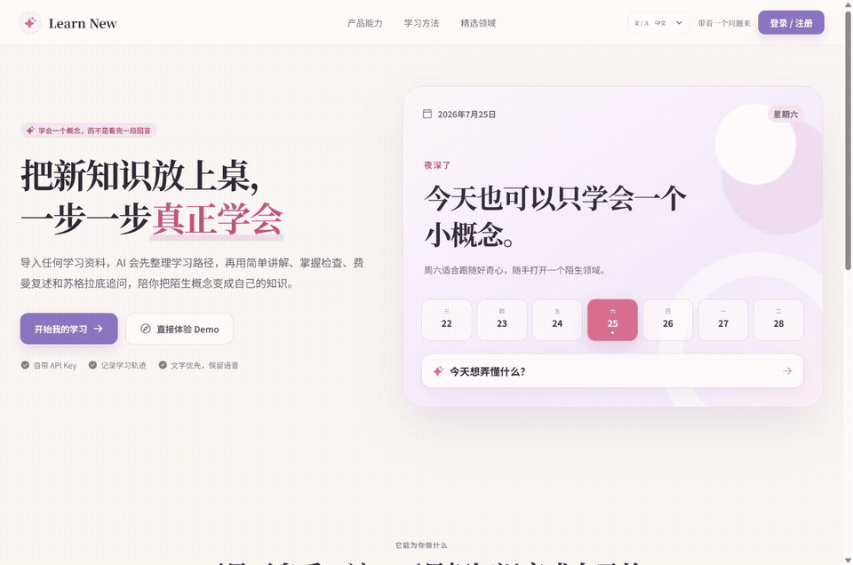

# Learn New

<p align="center">
  <strong>Turn “I think I understand” into “I can explain it clearly.”</strong>
</p>

<p align="center">
  A warm AI learning workspace powered by Feynman teach-backs and Socratic questioning.
</p>

<p align="center">
  <em>把“我好像看懂了”，变成“我真的能讲明白”。</em>
</p>

<p align="center">
  <a href="#install-the-skill"><strong>Install the Skill</strong></a>
  ·
  <a href="#run-and-deploy-the-web-app"><strong>Run the Web App</strong></a>
  ·
  <a href="#project-status"><strong>Project Status</strong></a>
</p>

<p align="center">
  
</p>

## What is Learn New?

Learn New is an AI learning product for anyone trying to understand a new concept, field, or practical skill. It turns source materials, explanations, comprehension checks, and active recall into a learning path that can be completed and verified.

Instead of ending with an AI answer, Learn New asks the learner to explain the idea back. The system listens like a student, restates what it understood, identifies missing or unclear parts, and continues with targeted questions.

The first inspiration came from an exam-preparation experience: textbooks, key topics, and past papers were given to AI, which then guided revision through structured questions and teach-backs. Learn New expands that method beyond exams to lifelong learning.

> 中文简述：Learn New 面向所有想学习新概念的人，不只服务于大学考试复习。它通过讲解、提问和复述，帮助用户把“看懂”变成真正理解。

### Example learning goals

- Understand AI Agents, workflows, connectors, or other emerging concepts.
- Explore psychology, economics, management, and product thinking.
- Learn from papers, textbooks, lecture notes, or personal materials.
- Build a practical skill with observable milestones.
- Prepare for an exam through structured review and diagnostics.

## The learning philosophy

Learn New combines two complementary approaches in one learning loop.

### Feynman Technique

The learner becomes the teacher and explains the concept in their own words. The AI first restates the learner’s meaning, then points out gaps, ambiguity, or contradictions. Clear explanation becomes evidence of understanding.

### Socratic Method

The AI avoids giving the conclusion too early. It uses progressive questions to examine assumptions, evidence, boundaries, counterexamples, and transfer to new situations.

Together, these approaches follow one rule:

> Progress is not measured by how much content you have seen. It is measured by whether you can explain, compare, transfer, and apply what you learned.

> 中文简述：费曼模式强调“讲出来”，苏格拉底模式强调“问到底”。两种方式共同检查用户是否真正掌握。

## Learning journey

```text
Choose a field or import learning materials
                    ↓
Analyze the topic and build a sequential learning map
                    ↓
Explain one concept in simple language
                    ↓
Run a comprehension check
                    ↓
Choose Feynman or Socratic deep-learning mode
                    ↓
Restate, diagnose gaps, and ask targeted questions
                    ↓
Update the cognitive calibration profile
                    ↓
Adjust the next learning step
```

1. **Import or choose materials** — Start from a textbook, paper, note, or a built-in knowledge pack.
2. **Build a learning map** — Create an ordered path showing what to learn, why it matters, how long it may take, and what counts as completion.
3. **Learn simply** — Establish an intuitive mental model and keep a practical example visible.
4. **Check understanding** — Let the learner decide when they are ready, then verify the claimed understanding.
5. **Go deeper** — Switch between Feynman teach-back and Socratic questioning.
6. **Receive teacher-style feedback** — The AI restates the learner’s meaning before addressing gaps.
7. **Adapt the path** — Record learning evidence in a cognitive calibration profile and adjust what comes next.

## Product experience

The web prototype is designed as a warm digital desk rather than a single chat window. It includes:

- a welcoming homepage with date, calendar, daily prompts, and lightweight updates;
- an email sign-in flow;
- a searchable domain bookshelf with built-in learning topics;
- support for importing personal materials;
- a sequential learning map;
- simple explanation and comprehension-check stages;
- visible Feynman and Socratic learning modes;
- a learning center with progress, strengths, improvement areas, and guidance;
- learning preferences, AI personality settings, privacy, and API configuration;
- responsive layouts for desktop and mobile;
- Chinese, English, Japanese, and Korean language entry points.

> 中文简述：网页体验采用粉紫色“数字书桌”风格，包含书架、学习地图、深度学习、学习中心和个性化设置。

## Two ways to use Learn New

### 1. Install the Skill

Use Learn New directly inside Codex as a structured learning workflow:

```text
Use $learn-new to help me understand what an AI Agent is from scratch.
```

```text
Use $learn-new to turn these materials into a learning map and begin with the first concept.
```

```text
Use $learn-new to review this topic with Feynman teach-back and Socratic questions.
```

### 2. Run or deploy the web prototype

Download the packaged React + Vite source, run it locally, or deploy it to your own hosting provider and domain.

The current web package is a public product prototype. Real accounts, cloud learning history, material parsing, and production AI calls still require a secure backend.

## Install the Skill

Download and extract [`Learn-New-skill.zip`](./Learn-New-skill.zip), then place the included `learn-new` folder in your Codex Skills directory:

```text
~/.codex/skills/learn-new/
```

Expected structure:

```text
learn-new/
├── SKILL.md
├── agents/
│   └── openai.yaml
└── references/
    └── learning-modes.md
```

Restart Codex and invoke the Skill with `$learn-new`.

> 中文：下载 Skill 压缩包，解压到 Codex 的 Skills 目录，重启后即可使用。

## What do these files mean?

| File | Primary audience | Purpose |
| --- | --- | --- |
| `README.md` | Visitors and contributors | Explains the product, installation, deployment, and public roadmap |
| `SKILL.md` | The AI running the learning session | Defines the learning workflow, checks, feedback, and safety boundaries |
| `agents/openai.yaml` | The Skill interface | Defines the display name, short description, and starter prompt |
| `references/` | The AI running the Skill | Stores detailed guidance for learning modes and session patterns |
| `AGENTS.md` | Coding agents maintaining the repository | Preserves long-term product decisions, privacy rules, and maintenance constraints |

### `SKILL.md`

The core instruction file for the learning workflow. It tells the AI when to activate Learn New, how to generate a learning map, how to teach and check understanding, and how to run Feynman or Socratic sessions.

### `agents/openai.yaml`

The interface metadata for the Skill. It controls how Learn New appears in the Skill list and which starter prompt is suggested.

### `references/`

Detailed teaching guidance loaded only when needed, including concept learning, practical skills, exam review, diagnostics, teach-backs, and Socratic questioning.

### `AGENTS.md`

Durable instructions for coding agents that maintain this project. It protects the product identity, learning model, visual direction, repository responsibilities, and privacy boundaries.

> 中文简述：README 给人看，SKILL.md 定义教学流程，references 保存详细方法，agents/openai.yaml 管理 Skill 展示，AGENTS.md 约束后续维护。

## Repository structure

```text
learn-new-things/
├── README.md
├── SKILL.md
├── AGENTS.md
├── agents/
│   └── openai.yaml
├── references/
│   └── learning-modes.md
├── learn-new-demo.gif
├── Learn-New-skill.zip
└── Learn-New-web.zip
```

## Run and deploy the web app

1. Download and extract [`Learn-New-web.zip`](./Learn-New-web.zip).
2. Open the extracted project directory.
3. Install dependencies and start the development server:

```bash
npm install
npm run dev
```

Create a production build:

```bash
npm run build
```

The static output is generated in `dist/client`. You can deploy it to a static hosting provider or connect your own domain.

For a production product, add secure server-side authentication, database storage, file processing, and AI API proxying. Never place user API keys directly in frontend code.

> 中文：网页包可以本地运行或部署到自己的平台和域名；正式上线前仍需接入安全的后端服务。

## Project status

- [x] Feynman teach-back and Socratic questioning Skill workflow
- [x] Concept, practical-skill, and exam-learning scenarios
- [x] Sequential learning maps and observable mastery evidence
- [x] Responsive desktop and mobile prototype
- [x] Chinese, English, Japanese, and Korean entry points
- [x] Downloadable Skill and web source packages
- [ ] Real email accounts and cloud learning history
- [ ] Production material parsing and storage
- [ ] Secure server-side AI integration with user-provided API keys
- [ ] Voice input and spoken teach-backs
- [ ] Long-term adaptive learning paths based on evidence

## Privacy and public boundaries

- Do not commit API keys, credentials, personal learning records, or private source materials.
- Do not publish any internal company project, data, document, workflow, customer information, or identifying detail.
- Use only public or fictional data in examples.
- Verify authoritative sources for high-risk or time-sensitive knowledge.
- Learn New supports legitimate learning and must not assist cheating during an active exam.

> 中文：不得公开公司内部项目或任何私密资料，示例只使用公开内容或虚构数据。

## Contributing

Forks, self-hosted experiments, issues, and new learning scenarios are welcome. Useful directions include:

- more natural Feynman teach-back feedback;
- deeper but less frustrating Socratic questions;
- document parsing and learning-map generation;
- mature cognitive calibration for adult learners;
- multilingual and accessible experiences.

---

Built in public by [Elia](https://github.com/liaxuan1206).
